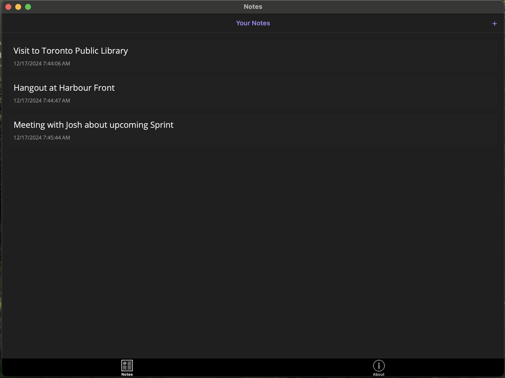

# Notes

A simple and intuitive Notes application built with MAUI. This app allows users to manage their notes efficiently by adding, deleting in Mobile as well as Desktop Devices.

## Screenshots

Note List Page | Add Note Page | About Page   
:-------------------------:|:-------------------------:|:-------------------------:
|  |  |  |

## Features

- Add new note
- Edit note
- Delete note

## Requirements

- .NET 8 or later
- VS Code / Visual Studio

## Installation

1. Clone the repository:

   ```bash
   git clone https://github.com/aashraybavisa/notes-maui.git
   ```

2. Open the project in VS Code

3. Open a XAML file, select Target Device and Run.

## Usage

1. Launch the app.
2. Use the '+' button to add a new note.
3. Click on a note to update or delete it.

## Contributing

Contributions are welcome! Please create a pull request with a detailed description of your changes.

## License

This project is licensed under the MIT License. See the `LICENSE` file for more details.
